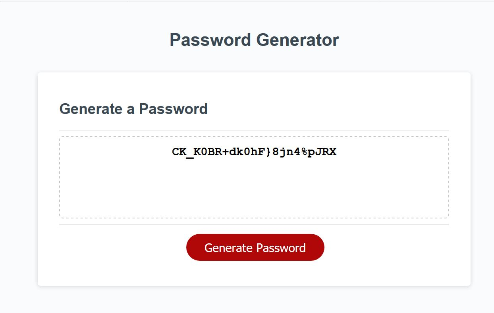

created variables to hold 4 types of strings of characters for lower, upper case, numbers and special

created variable to hold the pool of possible characters in a string

created four prompts to prompt for user input and add each class of characters to the string

created a while loop to be running untill one or more character sets are added to the character pool.

created a variable for an array which to hold the pool of possible characters for the password

created a split to split the ready pool sring and place in the array

created a while loop to request an input from the customer for the desired lenght

created conditions to keep the loop running untill the imput is a number , and is >8 and <128.

once validated , the length is alerted to the user

created an on click.listener for the "generate password" btn 

created a for loop to choose a random index from the passPull array and to convert it to the respective character,

one on each pass , and to add it to string variable untill the desired lencght is reached.

connected the variable to the inner.text style of the "textarea" element on the index file, so once the password reaches the desired 

length to be shown on the text area.

changed the fontSize and fotweight styles of the textarea so the password to be in bold and with a bigger font(22px)

put cometary on the "script.js" file code
{link to my portfolio3](https://github.com/zhim57/portfolio3)

